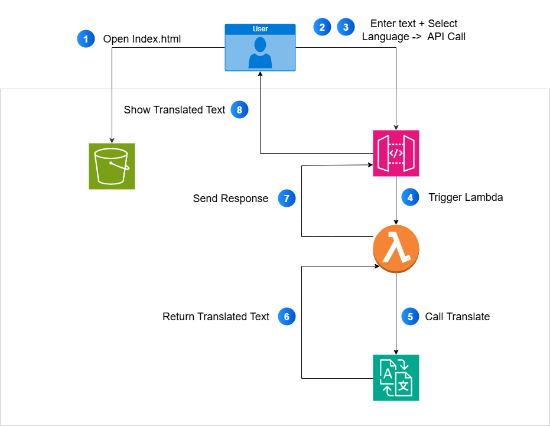

# 🌍 Language Translator on AWS

## 📌 Overview
This project is a **serverless Language Translator** built using AWS services.  
It allows users to input any text in a browser and translate it into **50+ global languages**.

---

## 🏗️ Architecture

**Components used:**

- **Amazon S3** → Hosts the frontend (`index.html`, CSS, JS).
- **Amazon API Gateway** → Exposes REST API for frontend to call backend.
- **AWS Lambda (Python 3.9)** → Executes translation logic using **Amazon Translate SDK**.
- **Amazon Translate** → Provides translation services for text.
- **IAM Role** → Grants Lambda permission to use Amazon Translate.

---

## 🔄 Workflow

1. User opens **index.html** hosted on **S3 (static website hosting)**.  
2. User enters text and selects a target language.  
3. The frontend calls **API Gateway endpoint**.  
4. **API Gateway** triggers **Lambda function (Python 3.9)**.  
5. Lambda uses **Boto3 Translate client** to call **Amazon Translate**.  
6. Amazon Translate auto-detects source language and returns translated text.  
7. The Lambda response is returned back via **API Gateway** to the frontend.  
8. User sees the translated text in the browser.  



---

## 📂 Repository Structure

```
├── index.html              # Frontend (HTML + CSS + JS)
├── language_translator.py      # Lambda function code (Python 3.9)
├── architecture.png  # Workflow architecture diagram
└── README.md               # Documentation
```

---

## 🚀 Deployment Steps

1. **Create S3 Bucket** → Enable static website hosting → Upload `index.html`.  
2. **Create Lambda Function** → Runtime: Python 3.9 → Paste code from `lambda_function.py`.  
3. **Assign IAM Role** → Attach policy to allow `translate:TranslateText`.  
4. **Create API Gateway** → REST API → Integrate with Lambda.  
5. **Deploy API** → Note down the invoke URL.  
6. **Update index.html** → Replace `YOUR_API_GATEWAY_URL` with the API endpoint.  
7. Open S3 website endpoint → Start translating 🚀.  

---

## ✅ Conclusion

This project demonstrated the deployment of a **serverless Language Translator** using AWS services.  
It is **scalable, cost-effective, and easy to extend** with more features like logging, authentication, or analytics.

